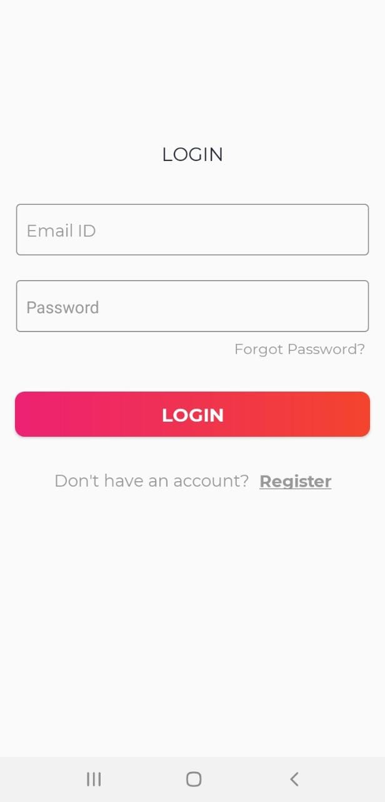
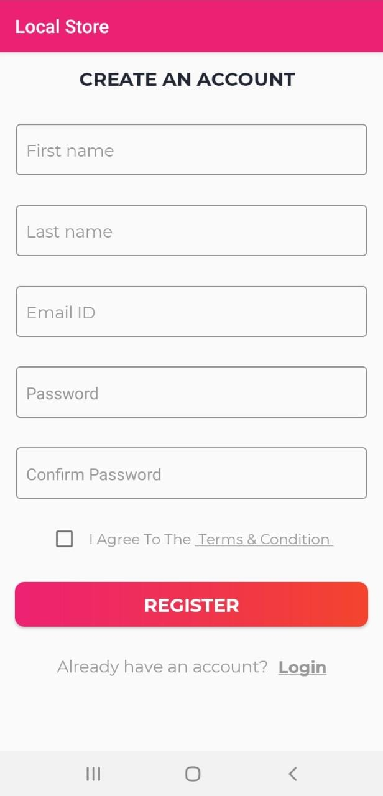
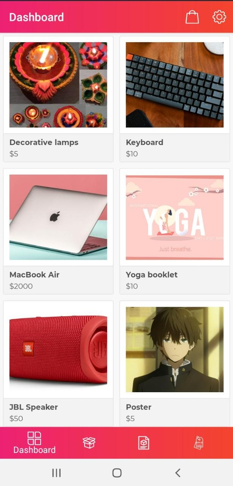
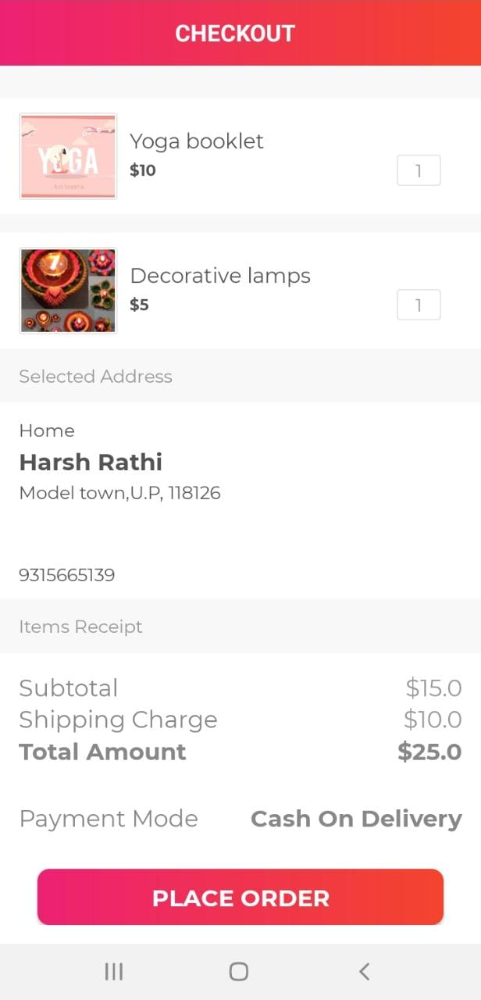
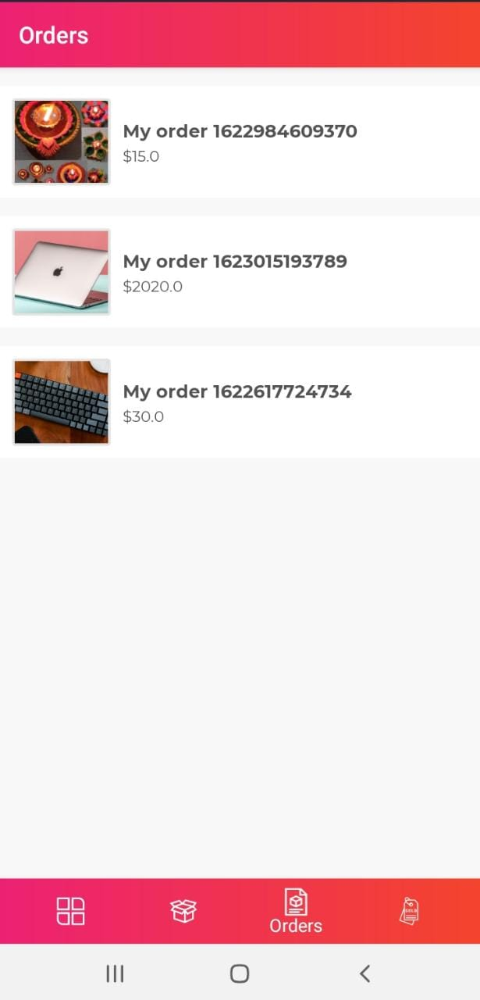

# Local-Store
## Introduction
Local store is an android application targeted for minimum SDK version 21.
It allows user to both sell and buy the products from the platform.
The application is build in Kotlin programming language.
The application uses Google Firebase technologies such as Firebase Authentication, Cloud Firestore and Firebase Storage.
The application provides sleek, simple and easy to use User interface built using latest material design.
## Technologies and Library Used
<li>Kotlin Programming Language</li>
<li>Firebase Authentication</li>
<li>Cloud Firestore</li>
<li>Firebase Storage</li>
<li>Retrofit</li>
<li>Glide</li>
<li>Material Design</li>
<li>XML</li>

## Screenshots
#### Authentication
 

### Profile

### Dashboard Fragment

### MyCart and Checkout

### Product Fragment

### Order Fragment

### Sold Fragment

